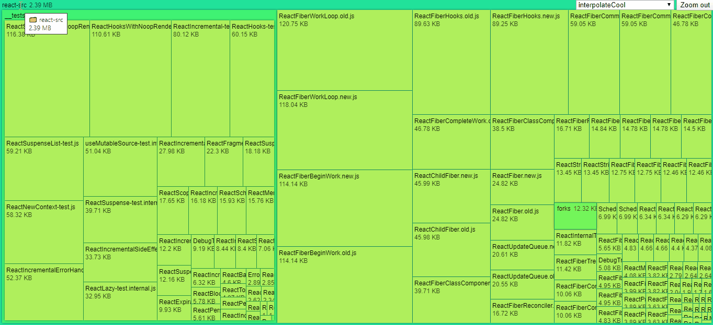

<h1 align="center">
    
</h1>
<h4 align="center">You can read the written tutorial about the implementation on <strong><a href="https://medium.com/javascript-in-plain-english/how-to-make-stunning-data-visualizations-with-d3-js-93a588600b45">Medium</a></strong> 🌲</h4>
